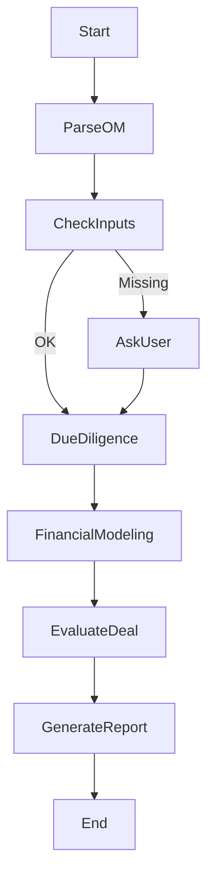

# 🏢 Real Estate Investment Agent (LangGraph-Powered)

This project is an AI-powered agent that evaluates commercial real estate investment opportunities (e.g., multifamily deals). It ingests Offering Memorandums (PDF/Excel), performs market due diligence, runs financial modeling, and generates an investment summary report — all via a LangGraph-powered pipeline.

---

## 🚀 Features

- 📄 Parse Offering Memorandums (PDF, Excel)
- 🌎 Pull demographic and economic data via Census and Zillow
- 📊 Calculate Cap Rate, IRR, DSCR, and Cash-on-Cash return
- 🤖 Use LLMs to assess deal quality and risks
- 📝 Generate detailed Markdown or PDF investment reports
- 🔁 Modular LangGraph pipeline for flexible automation

---

## 🧠 Architecture Overview



---

## 📁 Project Structure

```bash
real_estate_agent/
├── main.py                       # App entry point
├── agent/
│   ├── real_estate_agent.py      # LangGraph pipeline logic
│   ├── tools.py                  # Custom tools (Zillow, Census API, etc.)
│   └── prompts/
│       └── investment_eval_prompt.txt
├── chains/
│   ├── parser_chain.py
│   ├── due_diligence_chain.py
│   ├── financial_chain.py
│   └── report_chain.py
├── utils/
│   ├── parser.py
│   ├── finance_calculator.py
│   ├── visualization.py
│   └── census_api.py
├── data/
│   ├── raw/
│   └── processed/
├── docs/                         # Output reports
├── config.py                     # API keys and settings
└── requirements.txt
```

---

## 🧪 Setup Instructions

1. **Install dependencies**
   ```bash
   pip install -r requirements.txt
   ```

2. **Set up your API keys in `config.py`**
   - OpenAI API Key
   - US Census API Key
   - Zillow scraping or API support

3. **Run the pipeline**
   ```bash
   python main.py
   ```

---

## 🛠️ Tech Stack

- [LangChain](https://github.com/langchain-ai/langchain)
- [LangGraph](https://github.com/langchain-ai/langgraph)
- OpenAI GPT-4 or similar LLM
- PyMuPDF, Pandas for parsing
- WeasyPrint or Jinja2 for report generation
- US Census, Zillow APIs
- Matplotlib / Plotly for visualizations

---

## 📈 Example Use Case

1. Upload a multifamily Offering Memorandum.
2. The agent extracts rent rolls, operating statements, and assumptions.
3. It pulls demographics, crime rate, and comps for due diligence.
4. It calculates financial metrics like IRR and cap rate.
5. Finally, it evaluates the deal's strength and risk and generates a report.

---

## 🧩 Future Plans

- Add Streamlit UI
- Support voice-based input for investor Q&A
- Integrate with Google Maps and Walk Score
- Save and track historical deal evaluations

---

## 📬 Contact

Made by JJ Zhang 
For investment analysis or AI consulting, reach out at: JJ.Zhang.IN@gmail.com
